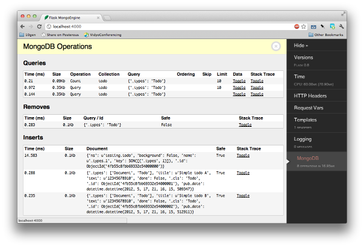

Flask-MongoEngine
=================

A Flask extension that provides integration with `MongoEngine <http://mongoengine.org/>`_.
For more information on MongoEngine please check out the `MongoEngine Documentation <http://docs.mongoengine.org/>`_.

It handles connection management for your app.
You can also use `WTForms <http://wtforms.simplecodes.com/>`_ as model forms for your models.

Installing Flask-MongoEngine
============================

Install with **pip**::

    pip install flask-mongoengine

Configuration
=============

Basic setup is easy, just fetch the extension::

    from flask import Flask
    from flask_mongoengine import MongoEngine

    app = Flask(__name__)
    app.config.from_pyfile('the-config.cfg')
    db = MongoEngine(app)

Or, if you are setting up your database before your app is initialized, as is the case with application factories::

    from flask import Flask
    from flask_mongoengine import MongoEngine
    db = MongoEngine()
    ...
    app = Flask(__name__)
    app.config.from_pyfile('the-config.cfg')
    db.init_app(app)

By default, Flask-MongoEngine assumes that the :program:`mongod` instance is running
on **localhost** on port **27017**, and you wish to connect to the database named **test**.

If MongoDB is running elsewhere, you should provide the :attr:`host` and :attr:`port` settings
in  the `'MONGODB_SETTINGS'` dictionary wih `app.config`.::

    app.config['MONGODB_SETTINGS'] = {
        'db': 'project1',
        'host': '192.168.1.35',
        'port': 12345
    }

If the database requires authentication, the :attr:`username` and :attr:`password`
arguments should be provided `'MONGODB_SETTINGS'` dictionary wih `app.config`.::

    app.config['MONGODB_SETTINGS'] = {
        'db': 'project1',
        'username':'webapp',
        'password':'pwd123'
    }

Uri style connections are also supported, just supply the uri as the :attr:`host`
in the `'MONGODB_SETTINGS'` dictionary with `app.config`. **Note that database name from uri has priority over name.** ::

    app.config['MONGODB_SETTINGS'] = {
        'db': 'project1',
        'host': 'mongodb://localhost/database_name'
    }

Connection settings may also be provided individually by prefixing the setting with `'MONGODB_'` in the `app.config`.::

    app.config['MONGODB_DB'] = 'project1'
    app.config['MONGODB_HOST'] = '192.168.1.35'
    app.config['MONGODB_PORT'] = 12345
    app.config['MONGODB_USERNAME'] = 'webapp'
    app.config['MONGODB_PASSWORD'] = 'pwd123'

Custom Queryset
===============

flask-mongoengine attaches the following methods to Mongoengine's default QuerySet:

* **get_or_404**: works like .get(), but calls abort(404) if the object DoesNotExist.
* **first_or_404**: same as above, except for .first().
* **paginate**: paginates the QuerySet. Takes two arguments, *page* and *per_page*.
* **paginate_field**: paginates a field from one document in the QuerySet.
  Arguments: *field_name*, *doc_id*, *page*, *per_page*.

Examples::

    # 404 if object doesn't exist
    def view_todo(todo_id):
        todo = Todo.objects.get_or_404(_id=todo_id)
    ..

    # Paginate through todo
    def view_todos(page=1):
        paginated_todos = Todo.objects.paginate(page=page, per_page=10)

    # Paginate through tags of todo
    def view_todo_tags(todo_id, page=1):
        todo = Todo.objects.get_or_404(_id=todo_id)
        paginated_tags = todo.paginate_field('tags', page, per_page=10)

Properties of the pagination object include: iter_pages, next, prev, has_next,
has_prev, next_num, prev_num.

In the template::

    
      

      
        
          
            <a href="{{ url_for(endpoint, page=page) }}">{{ page }}</a>
          
            <strong>{{ page }}</strong>
          
        
          …
        
      
      

    

MongoEngine and WTForms
=======================

You can use MongoEngine and WTForms like so::

    from flask_mongoengine.wtf import model_form

    class User(db.Document):
        email = db.StringField(required=True)
        first_name = db.StringField(max_length=50)
        last_name = db.StringField(max_length=50)

    class Content(db.EmbeddedDocument):
        text = db.StringField()
        lang = db.StringField(max_length=3)

    class Post(db.Document):
        title = db.StringField(max_length=120, required=True, validators=[validators.InputRequired(message=u'Missing title.'),])
        author = db.ReferenceField(User)
        tags = db.ListField(db.StringField(max_length=30))
        content = db.EmbeddedDocumentField(Content)

    PostForm = model_form(Post)

    def add_post(request):
        form = PostForm(request.POST)
        if request.method == 'POST' and form.validate():
            # do something
            redirect('done')
        return render_template('add_post.html', form=form)

Supported fields
================

* StringField
* BinaryField
* URLField
* EmailField
* IntField
* FloatField
* DecimalField
* BooleanField
* DateTimeField
* **ListField** (using wtforms.fields.FieldList )
* SortedListField (duplicate ListField)
* **EmbeddedDocumentField** (using wtforms.fields.FormField and generating inline Form)
* **ReferenceField** (using wtforms.fields.SelectFieldBase with options loaded from QuerySet or Document)
* DictField

Not currently supported field types:
====================================

* ObjectIdField
* GeoLocationField
* GenericReferenceField

Session Interface
=================

To use MongoEngine as your session store simple configure the session interface::

    from flask_mongoengine import MongoEngine, MongoEngineSessionInterface

    app = Flask(__name__)
    db = MongoEngine(app)
    app.session_interface = MongoEngineSessionInterface(db)

Debug Toolbar Panel
===================

If you use the Flask-DebugToolbar you can add
`'flask_mongoengine.panels.MongoDebugPanel'` to the `DEBUG_TB_PANELS` config
list and then it will automatically track your queries::

    from flask import Flask
    from flask_debugtoolbar import DebugToolbarExtension

    app = Flask(__name__)
    app.config['DEBUG_TB_PANELS'] = ['flask_mongoengine.panels.MongoDebugPanel']
    db = MongoEngine(app)
    toolbar = DebugToolbarExtension(app)

Upgrading
=========

0.6 to 0.7
----------

`ListFieldPagination` order of arguments have been changed to be more logical::

    # Old order
    ListFieldPagination(self, queryset, field_name, doc_id, page, per_page, total)

    # New order
    ListFieldPagination(self, queryset, doc_id, field_name, page, per_page, total)

Credits
========

Inspired by two repos:

`danjac <https://bitbucket.org/danjac/flask-mongoengine>`_
`maratfm <https://bitbucket.org/maratfm/wtforms>`_
